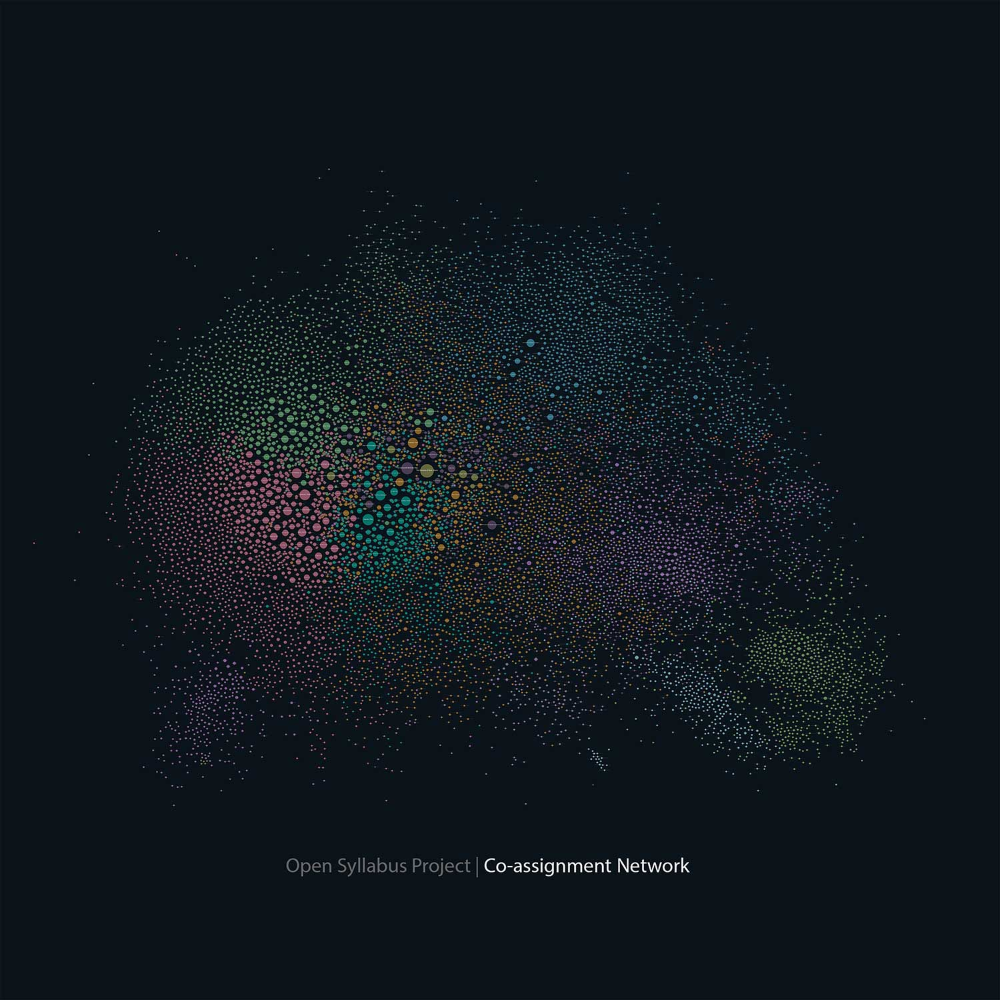

🚨🚨
NOTE: This repository is an old, beta version of Open Syllabus that was online circa 2016. The code here isn't what's powering the current [Explorer](https://opensyllabus.org/) or [Galaxy](https://galaxy.opensyllabus.org/) websites.
🚨🚨

# Open Syllabus Project

#### [explorer.opensyllabusproject.org](http://explorer.opensyllabusproject.org)

A force-directed layout of the co-assignment network for the top ~10,000 texts.

Welcome! The Open Syllabus Project is an effort to see what can be learned by analyzing the contents of a corpus of over 1 million college course syllabi.  Here you'll find:

- The source code for the Open Syllabus Explorer web application.

- A set of generalized utilities for interacting with the corpus.

- Routines that extract information about citations, fields, institutions, and locations from the syllabi.

- A harness for parallelizing jobs across multiple EC2 instances. (It would take about a month to run the citation extraction job on your laptop!)

- Tools for analyzing the structure of the citation graph.

Head over to [osp-deploy](https://github.com/davidmcclure/osp-deploy) for a set of Ansible playbooks for deploying to Vagrant / EC2.

## How do I get the data?

Drop us a line at syllabusopen@gmail.com. We're actively looking to develop research collaborations around this corpus, and would love to hear about what you're working on.
